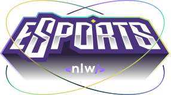
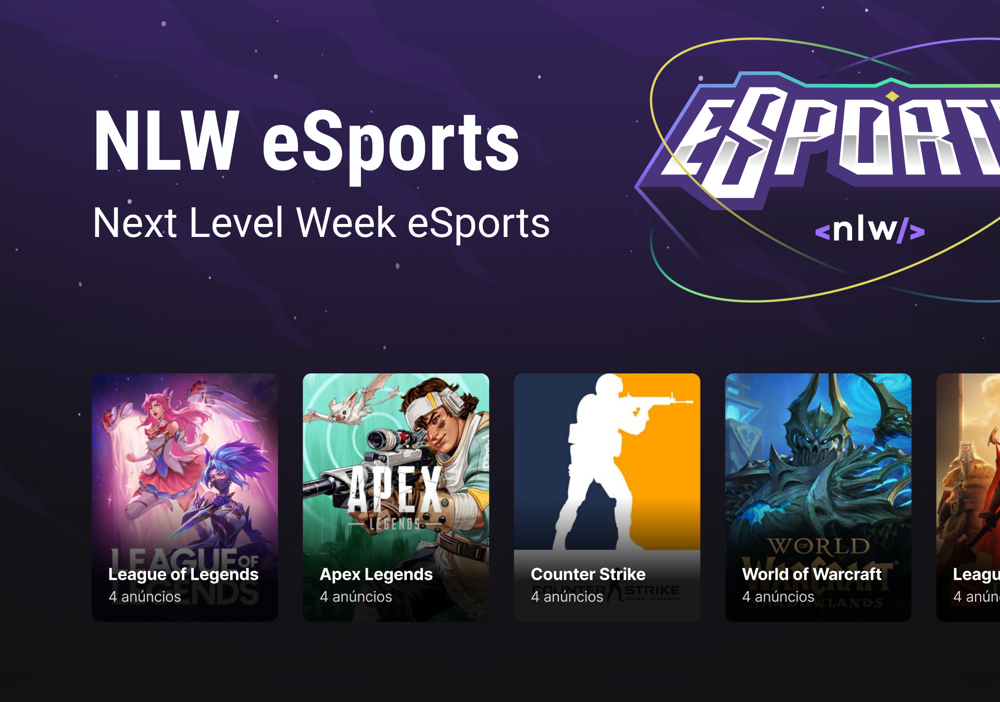

  

    

 

# 💻 Projeto

A plataforma do e-sports permite o usuário criar um anuncio dos seus jogos favoritos com o seu horário disponível na semana para jogar com o objetivo de encontrar duos (companhias) para se juntar a jogatina e jogarem juntos.

Projeto desenvolvido durante o #NLW da Rocketseat - 2022.
 
# 🧪 Tecnologias

Esse projeto foi desenvolvido com as seguintes tecnologias:

Front-End:
- [ReactJS](https://pt-br.reactjs.org/);
- [Tailwind CSS](https://tailwindcss.com/);
- [Typescript](https://www.typescriptlang.org/);
- [Vite](https://vitejs.dev/).

Back-End:
- [NodeJS](https://nodejs.org/en/);
- [ExpressJS](https://expressjs.com/pt-br/);
- [Prisma](https://www.prisma.io/);
- [SQLite](https://www.sqlite.org/index.html).

Mobile:
- [React Native](https://reactnative.dev/);
- [Expo](https://docs.expo.dev/).

# 🚧 E-Sports 2.0

- Validação dos formulários (Web e Mobile);
- Responsividade (Web) ✔;
- Criar anúncio (Mobile);
- Landing Page (Web);
- Consumir dados do Discord (Web e Mobile);
- Conectar com usuários (Web);
- Adicionar slider (Web) ✔;
- Sistema de Login com o Discord (Web e Mobile) ✔.

# 🔖 Layout

Você pode visualizar o layout do projeto através do link abaixo:
- [Layout Web](https://www.figma.com/file/YZzryY6irUqFISxc4MpwB6/NLW-eSports?node-id=0%3A1) (Lembrando que você precisa ter uma conta no Figma).

## 📃 License

[MIT](https://choosealicense.com/licenses/mit/)